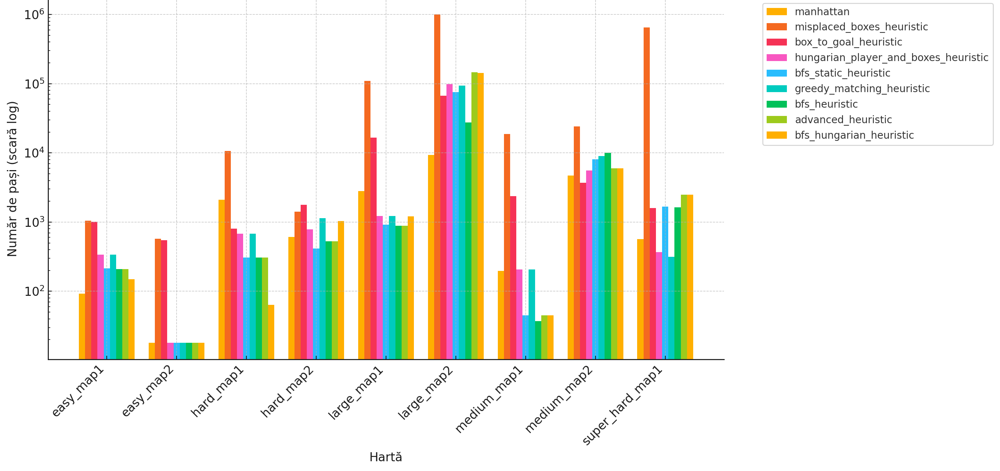
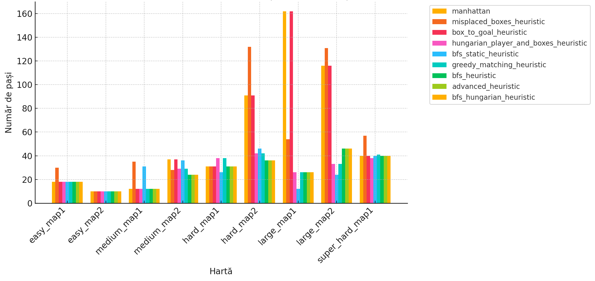
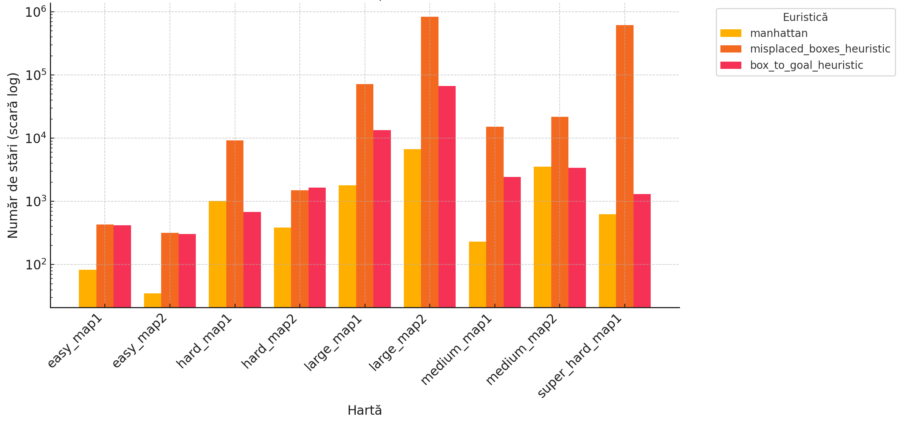
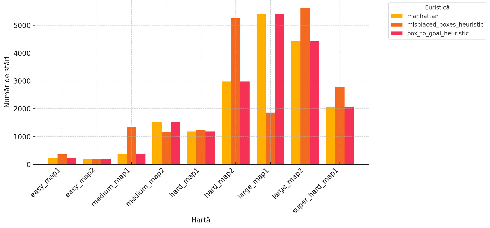
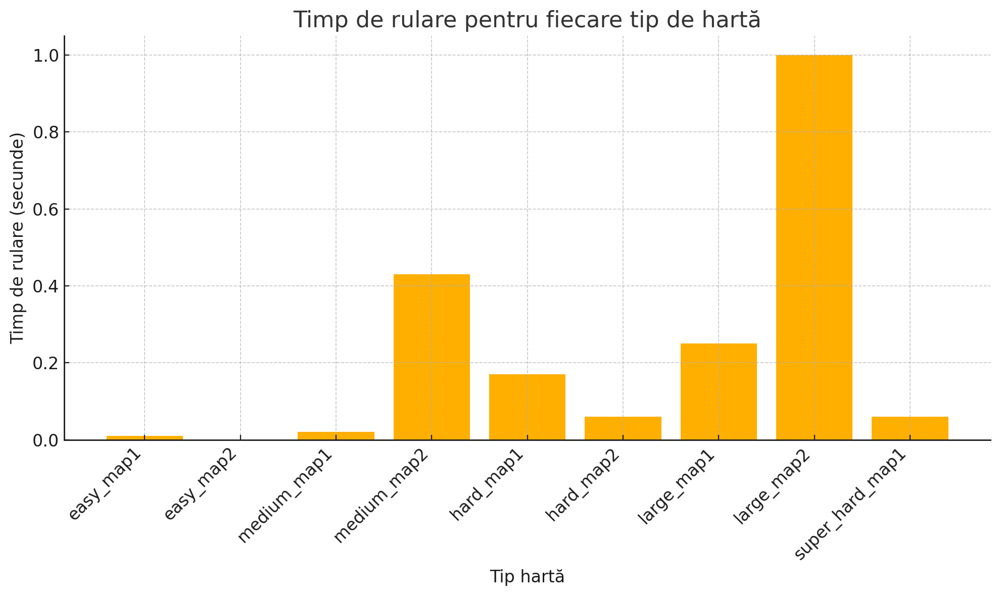
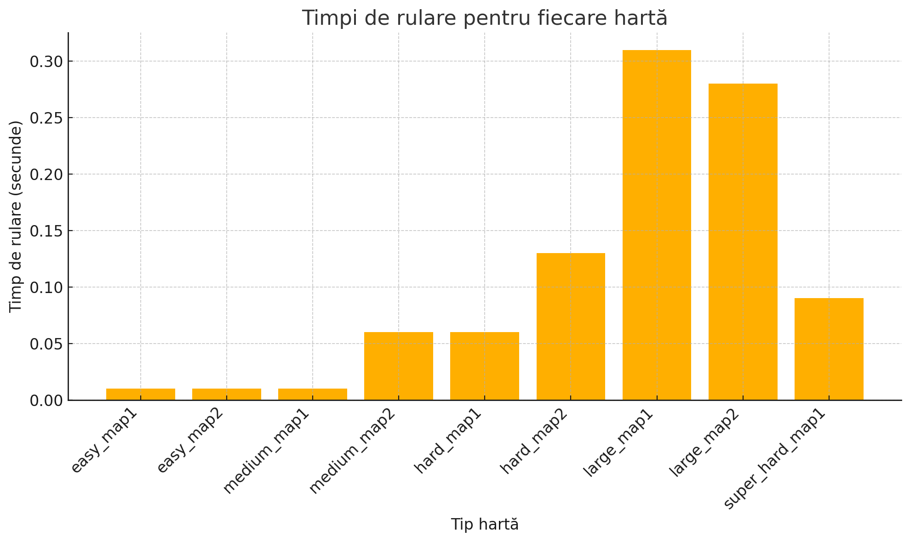

Teodor Matei Bîrleanu 334CA						27.04.2024

# SOKOBAN README

### ASSIGNMENT 1 AI

I will start by describing the implementation of the Learning Real-Time A* (LRTA*) algorithm. I began by studying the pseudocode from the course, then proceeded by modifying the code from laboratory 1. Additionally, I utilized references for LRTA* [1] and Beam Search [2].

## LRTA*

For the LRTA* section, I conceptually altered the approach since there is no frontier, only a single current node, and decisions are made step-by-step as the algorithm progresses. Regarding the heuristic, I combined the initial heuristic with an adaptive memory updated at every step, differing from the classic A* algorithm where heuristic values remain unchanged.

At each step, from the current state, I generate all successors and retrieve or initialize their associated values. Then I select the best successor from each move and update the value of the current state. The algorithm stops once the number of allowed steps is exceeded or a final state is reached. The cost is stored in a dictionary H, mapping each map to a learned estimated cost.

Essentially, I integrated A*'s concept of successor generation, evaluation, heuristic cost updating, and path memory.

## Beam Search

For the Beam Search algorithm, I started from concepts presented in the course within the Local Beam Search algorithm, making several modifications.

I began with a single initial state rather than randomly generating k states as presented in class materials. I also avoided re-expanding states by implementing a "visited" dictionary. To recover the complete solution path, each beam element is a tuple consisting of the map state, a sequence list of states from start to current, and the number of moves (though equivalent to the length of the state sequence, I preferred keeping it separate for readability).

For each candidate, I verify whether it has been visited and compute the heuristic score, always selecting the higher heuristic value, offering a more promising state.

## Heuristics Used

For heuristics, I started with two concepts. One heuristic calculates the Manhattan distance from each node to the closest box plus the distance from that box to the target. Another heuristic approach has two types: when holding a box, I only calculate the distance to the target; when not holding a box, I calculate the distance to the nearest box. Being a matrix, only Manhattan distances were employed. An additional concept involves prioritizing these two distances with weighted importance.

I also considered adding a heuristic named `misplace_box`, counting how many boxes are not yet in their positions. It is weaker but included for statistical and graphical analysis.

## Heuristic Comparison

### Comparison based on number of steps:
#### LRTA* Steps

#### Beam Search Steps

#### Observations:
- The heuristic `Misplace_box` (number of misplaced boxes) performs the worst, especially on large maps (Large2, Super_hard1), generating hundreds of thousands to millions of steps, rendering it nearly useless.
- Manhattan is acceptable on small maps but drastically increases steps on larger ones.
- BFS-based heuristics significantly improve results on larger tests.
- Beam Search neutralizes heuristic differences, yielding similar outcomes.

### Conclusions:
- LRTA* shows vast differences among heuristics (especially large maps), while Beam Search maintains similar hierarchies with significantly fewer steps and less variability.

### Comparison based on number of expanded states:
#### LRTA* Expanded States

#### Beam Search Expanded States

#### Observations:
- Beam Search drastically reduces expanded states for all heuristics.
- Manhattan and Box_to_goal have similar performances, slightly favoring Manhattan.
- Misplace_box remains the weakest but significantly improves with Beam Search.

### Conclusions:
- Beam Search considerably reduces the absolute number of expanded states.

### Comparison based on runtime:
#### LRTA* Runtime

#### Beam Search Runtime

#### Observations:
- Beam Search considerably reduces runtime (up to 3–5× faster than LRTA*), though LRTA* exhibits greater time variability.

### Conclusions:
- Beam Search consistently achieves lower runtime across most maps compared to LRTA*.

### Comparison based on number of pull operations:
#### LRTA* Pull Operations

#### Beam Search Pull Operations

    
#### Observations:
- Beam Search greatly minimizes pull operations compared to LRTA*, significantly smoothing out differences among heuristics.

### Conclusions:
- Beam Search greatly reduces pull operations across all heuristics, nearly eliminating disadvantages of weaker heuristics.

## References
- [1] https://turing.cs.pub.ro/blia_2003/Real-time_search_1.htm
- [2] https://www.geeksforgeeks.org/introduction-to-beam-search-algorithm/
- https://www.askpython.com/python/examples/beam-search-algorithm
- [3] https://www.sciencedirect.com/science/article/pii/S0004370215000867
- https://timallanwheeler.com/blog/2022/01/19/basic-search-algorithms-on-sokoban/
- https://timallanwheeler.com/blog/2022/01/23/sokoban-reach-and-code-performance/
- https://stackoverflow.com/questions/4237462/sokoban-solver-tips

